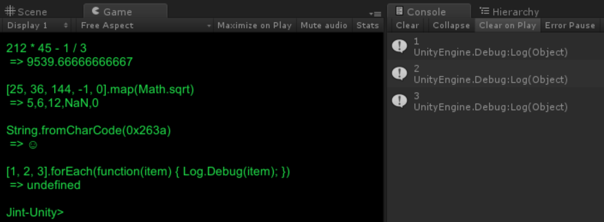

#### Jint-Unity

`Jint-Unity` is a fork of **[Jint](https://github.com/sebastienros/jint)**: a Javscript _interpreter_ for .NET. Jint does not JIT. This is important. This fork provides a few things that Jint proper does not:

* Compliant with the **.NET 3.5 Subset** that Unity uses.
* Fixes for **iOS compatibility**: yes, this runs on iOS!
* **Deep integration** with Unity: APIs for days!
* An awesome **Unity scene query language** aptly named UQL.
* Useful platform APIs:
	* Modularize with **[require()](Documentation/require.md)**!
	* Plugin to DI frameworks with **[inject()](Documentation/inject.md)**!
* Lots of Unity examples-- including a **full REPL**.

##### Build Process

All Jint projects can be found in Master.sln, which can be built like any Visual Studio Solution.

If you'd like to build all project and copy all project dlls into all examples, run `gradle buildAll`. This, of course, requires **[gradle](http://gradle.org)**.